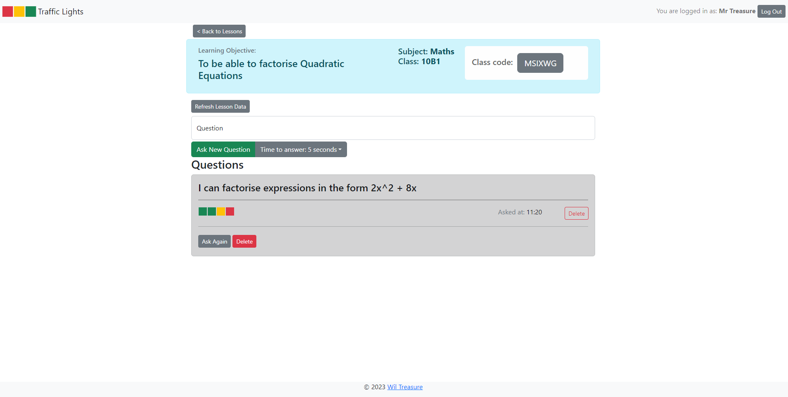

# Traffic-Lights
A simple traffic lights tool for class feedback in remote teaching.



## Technologies Used
This app uses the following technologies:
* React
* React-Bootstrap for styling
* Node.js
* Express
* Socket.io
* https://shortunique.id/

## How to Run the App

You'll need to open a terminal and:

#### Installation
* navigate to ```/backend``` and run ```npm i```
* navigate to ```/frontend/traffic-lights``` and run ```npm i``` 

#### Environment
* You need MongoDB installed (or use MongoDBAtlas) and you'll need to create files for ```.env.development```, ```.env.production``` and ```.env.test``` in the ```/backend``` folder pointing at your database and the PORT you want to use.
* You need a .env file in the ```/frontend/traffic-lights``` pointing to your backend PORT

#### Running
You'll need two terminals open.
* Navigate to ```/backend``` and use the command ```npm start``` or ```npm run start-win``` if on Windows.
* Navigate to ```/frontend/traffic-lights``` and use the command ```npm start```.

To be able to test the usability you'll need to have the app open in more than one tab, so that you can play Teacher and Pupil.

## How it works
Traffic Lights is a simple feedback system I used in my time as a secondary maths teacher. It allows you to collect class feedback using a simple Green/Amber/Red response, and a teacher can then use this feedback to make quick decisions about the direction of a lesson. This might mean assigning differentiated tasks, or supporting learning with more scaffolding, or even recognising that pupils aren't being challenged.

I used traffic lights all the time in the classroom. In the past few years I've been on the other side, as a remote learner, and it occurred to me that getting that feedback from a remote class is even harder. A simple tool that allows you to ask questions, get responses and save responses in real-time could be valuable. My goals here were to create something that was easy and intuitive to use. It doesn't require an account, but as a teacher you can create one and save lesson feedback for future use if you want. 

Like all classroom tools (or any data collection for that matter) it's not perfect. Using it well requires asking good, meaningful questions, and creating a classroom culture that supports honesty and pupil ownership of their progress.

## Feedback
I'm new to software development, and feedback on this project is very welcome, either on the code or the user-experience! I've got a lot to learn.